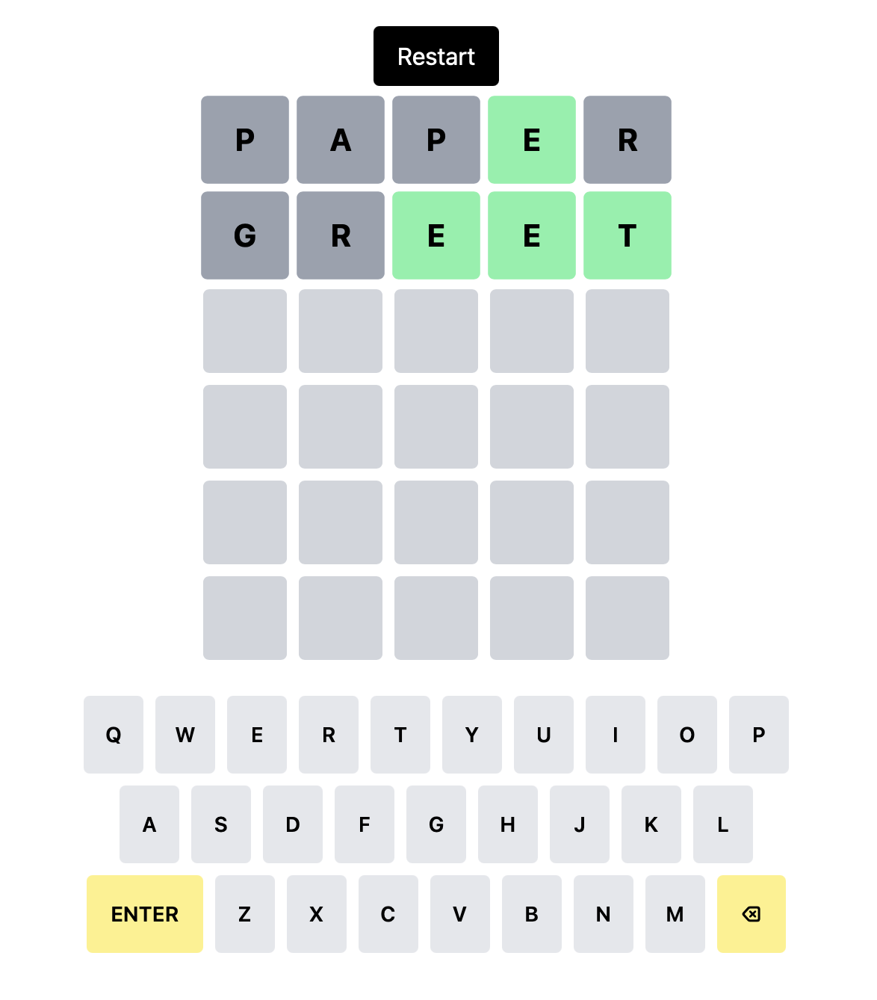

# 🧩 Lexis — A Word Deduction Game

Lexis is a browser-based word deduction game inspired by modern daily word puzzles, built from scratch with custom architecture, animations, and extensible game logic.

The project focuses on clean React design, state-driven gameplay, and polished user feedback while remaining fully playable on both desktop and mobile devices.

<br>
<br>

## 🎮 Gameplay Overview

- Guess a hidden **5-letter word**
- You have **6 attempts**
- Each guess provides feedback for every letter:
  - 🟩 Correct letter in the correct position
  - 🟨 Correct letter in the wrong position
  - ⬛ Letter not in the word
- Invalid words are rejected with a **row shake animation**
- The game ends when you either guess the word or run out of attempts



<br>
<br>


## ✨ Features

### Core Gameplay
- Random or deterministic word selection
- Physical keyboard and on-screen keyboard support
- Dictionary-based word validation
- Restartable game session

### UI & UX
- Responsive layout for mobile and desktop
- Animated on-screen keyboard using Framer Motion
- Row shake animation for invalid guesses
- Tile flip animations on word submission
- Clear win / lose feedback

### Architecture
- Modular component-based design
- Centralized input handling
- Declarative animations
- Strong separation of game logic and presentation

<br>
<br>


## 🛠 Tech Stack

- **React**
- **TypeScript**
- **Tailwind CSS**
- **Framer Motion**
- **Vite**

<br>
<br>

## 🧠 Design Decisions

- **Single input pipeline**  
  Both physical and on-screen keyboard inputs use the same handler to avoid duplicated logic.

- **Clear responsibility boundaries**
  - `App` manages game rules and state
  - `Grid` controls layout
  - `Row` handles animations
  - `Tile` is purely presentational

- **Animation strategy**  
  All animations are declarative and state-driven using Framer Motion — no direct DOM manipulation.

<br>
<br>

## ▶️ Running Locally

```bash
npm install
npm run dev